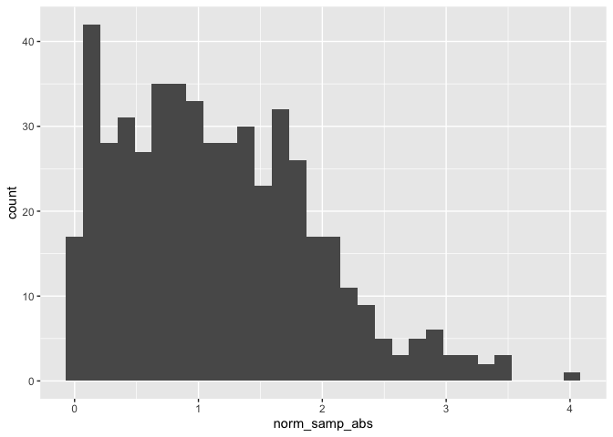

Simple document
================
Claudia Huynh
09-10-2024

I’m an R Markdown document! I loaded necessary packages from the library
tidyverse

# Section 1

Here’s a **code chunk** that samples from a *normal distribution*:

    ## [1] 100

# Section 2

I can take the mean of the sample, too! The mean is 0.2882222.

# Learning Assessment

Write a named code chunk that creates a dataframe comprised of: a
numeric variable containing a random sample of size 500 from a normal
variable with mean 1; a logical vector indicating whether each sampled
value is greater than zero; and a numeric vector containing the absolute
value of each element. Then, produce a histogram of the absolute value
variable just created. Add an inline summary giving the median value
rounded to two decimal places. What happens if you set eval = FALSE to
the code chunk? What about echo = FALSE?

``` r
la_df = 
  tibble(
  norm_samp = rnorm(500, mean = 1),
  norm_samp_logical = norm_samp > 0,
  norm_samp_abs = abs(norm_samp)
  )

ggplot (la_df, aes(x = norm_samp_abs)) + geom_histogram()
```

<!-- -->
